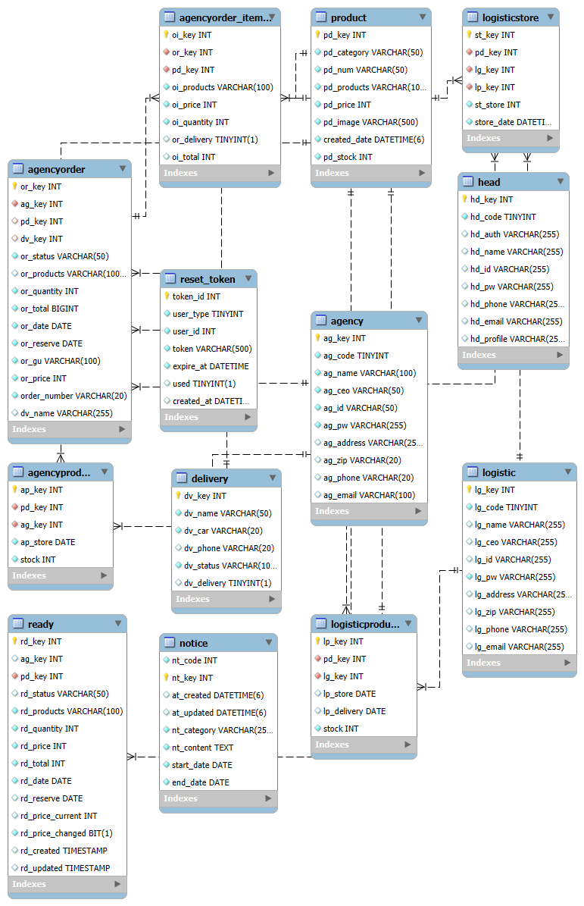

## 📌 프로젝트 요약

  이 프로젝트는 본사–대리점–물류 간 분산되어 있던 발주·승인·출고 업무를 하나의 서비스에서 처리할 수 있도록 구축한 통합 주문 관리 시스템입니다.

  운영 흐름을 기준으로 화면과 권한을 분리해, 각 사용자가 필요한 기능만 접근하도록 구성했습니다.

  본사: 제품·재고·계정 관리 및 주문 승인

  대리점: 지정된 품목 기준으로 발주 생성 및 임시저장

  물류: 승인된 주문 기반 출고 및 배송 처리

  전체 프로세스는 주문 생성 → 승인 → 출고 → 배송까지 하나의 흐름으로 정리되어 있어 업무 누락과 중복을 방지하고, 재고·상태 변화가 단계별로 자동 반영되도록 설계했습니다.

  ** 전반적인 설명은 PPT는 [여기] https://docs.google.com/presentation/d/1zcEe9KEAa85HYeGfOjlPDVmb6tf-XjLH/view?usp=drive_link&ouid=101586504881783479394&rtpof=true&sd=true 에서 확인하세요!
  
---

## 주요 기능 구성
  1. 인증(공통)

    - 로그인

    - 회원가입(본사 계정 생성)

    - 비밀번호 찾기: 이메일 기반 임시 비밀번호 발송 및 재설정 지원

  2. 본사(Head Office)
    
    ** 메인 대시보드

      - 기간별 주문 건수, 출고 현황, 재고 변동을 그래프로 시각화

      - 당일 기준 처리할 업무를 빠르게 파악할 수 있는 홈 화면 구성


    ** 제품 및 대리점 관리

      - 전체 제품 목록 관리

      - 물류 제품 재고 관리

      - 각 대리점마다 취급 품목을 개별 지정하는 기능

      - 대리점/물류 업체 계정 생성 및 사용자 관리


    ** 주문 승인 프로세스

      - 대리점이 생성한 주문 건을 본사가 검토 후 승인/반려 처리

      - 승인된 주문만 물류로 전달되어 출고 작업을 진행할 수 있도록 제어


    ** 물류 입고 관리

      - 물류 재고가 부족할 경우 본사에서 입고 처리 가능

      - 재고 반영 후 전체 흐름 자동 갱신


    ** 공지사항 관리

      - 전체 사용자에게 전달되는 공지사항 작성 및 배포 기능


  3. 대리점(Agency)

    ** 주문 관리

      - 본사에서 지정해준 취급 품목만 조회 가능

      - 필요 제품을 선택해 신규 주문 생성

      - 주문 작성 중 언제든 임시저장(장바구니) 가능


    ** 재고 및 품목 조회

      - 본사 기준 제품 재고 현황 확인

      - 대리점에서 자주 발주하는 품목을 빠르게 관리할 수 있는 UI 구성


    ** 주문 현황 모니터링

      - 본사 승인 상태, 물류 출고 여부 등
          
      - 진행 중인 주문의 전체 상태를 한눈에 확인


  4. 물류(Logistics)
    
    ** 출고 관리

      - 본사에서 승인 처리한 주문만 자동 수신

      - 주문 상세 팝업을 통해 배송 기사 배정, 출고 등록 기능 제공


    ** 재고 관리

      - 현재 물류창고의 제품 재고 현황 조회

      - 본사 입고 처리 시 재고 자동 업데이트

## 📁 프로젝트 디렉토리 구조

/frontend  
  React 기반 프론트엔드 애플리케이션

/backend  
  Spring Boot 기반 백엔드 API 서버

/docs  
  ERD 이미지


## 아키텍처 다이어그램

```plaintext
┌───────────────────────────┐
│      Frontend (React)     │
│ - React 19 (SPA)          │
│ - Redux Toolkit           │
│ - React Router DOM        │
│ - Axios + Token Intercept │
└───────────────▲───────────┘
                │ REST API
                │
┌───────────────┴───────────┐
│   Backend (Spring Boot)   │
│ - Spring MVC              │
│ - Spring Security + JWT   │
│ - Service / Repository    │
│ - JPA / Hibernate         │
└───────────────▲───────────┘
                │ JPA Query
                │
┌───────────────────────────┐
│      Database (Mysql)     │
│ - 주문 / 주문항목          │
│ - 제품 / 재고              │
│ - 대리점 / 계정            │
└───────────────▲───────────┘
```

## 🛠 기술 스택

## Frontend Tech Stack
- React 19
- TypeScript
- Redux Toolkit 2.x, React-Redux
- React Router DOM 7.x
- Axios (+ Custom axiosInstance)
- Bootstrap 5, React-Bootstrap, Custom CSS
- Recharts
- jwt-decode
- Vite 7
- ESLint 9, eslint-plugin-react-hooks

## Backend Tech Stack
- Spring Boot 3.5.5
- Java 17
- Spring MVC (REST API)
- Spring Data JPA, Hibernate
- MySQL
- Spring Security
- JWT (JJWT 0.11.5)
- Jakarta Validation
- Spring Mail
- Lombok
- Gradle
- JUnit, Spring Boot Test

## Database

- MySQL 8

- Workbench 기반 ERD 설계

- Foreign Key 기반 관계형 모델 설계

- 주문/제품/재고/계정/대리점 중심 도메인 구조 구축

## DevOps & Infra

- AWS EC2

- Git & GitHub (형상 관리)

---

## Development Tools

- VSCode / IntelliJ IDEA

- Postman (API 테스트)

- GitHub Projects / Issues (기능 관리)

## 🗂 ERD 개요

본 프로젝트에서 사용된 핵심 데이터 구조는 아래와 같습니다.  
전체 상세 ERD는 docs/erd.md 문서를 참조해주세요.




## 기술적 해결 포인트

1. JWT 기반 인증·인가 구조 설계

Spring Security + JWT를 적용해 사용자 유형(본사/대리점/물류)에 따라 접근 권한을 명확히 분리했습니다.

Axios 인터셉터로 토큰 자동 주입, 만료 시 처리, 공통 에러 핸들링 흐름을 구성했습니다.

2. 주문–승인–출고까지 이어지는 단일 업무 흐름 구현

주문 생성 → 본사 승인 → 물류 출고 → 배송 완료까지 하나의 상태 흐름으로 통합했습니다.

각 단계의 승인 상태와 재고 변화가 자동 반영되도록 설계해 누락이나 중복 처리를 방지했습니다.

3. 역할 기반 UI 및 상태 기반 렌더링

사용자 역할에 따라 필요한 정보만 노출되도록 화면을 분리해 혼선과 실수 가능성을 낮췄습니다.

주문 상태(승인 대기, 출고 대기, 배송중 등)에 따라 버튼과 액션이 동적으로 변하도록 구성했습니다.

4. Axios 커스텀 인스턴스 + 공통 에러 처리

모든 API 요청을 공통 axiosInstance로 통합 관리했습니다.

응답 코드 기반 분기 처리, 에러 메시지 일관화, 토큰 검증 등 클라이언트 전반의 네트워크 흐름을 표준화했습니다.

## 🚀 실행 방법

1) Backend (Spring Boot)

cd backend
./gradlew bootRun

- 서버는 기본적으로 http://54.116.2.82:8080 에서 동작합니다.

2) Frontend (React + Vite)

cd frontend
npm install
npm run dev

